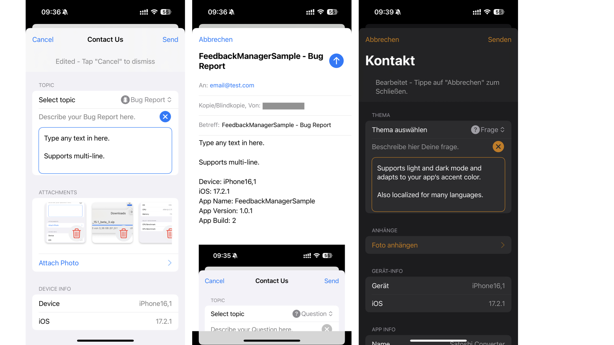

# PSFeedbackManager

A lightweight SwiftUI library that allows users to send feedback via email.

This a SwiftUI re-write of [SwiftyFeedback](https://github.com/juanpablofernandez/SwiftyFeedback).

It works on iOS, iPadOS, macOS (Designed for iPad) and macCatalyst with version 16.0 or higher.



## Contents

* [Requirements](#requirements)
* [Installation](#installation)
* [Usage](#usage)
* [Notes](#notes)
* [Contribute](#contribute)
* [License](#license)

## Requirements

- iOS 16.0+
- iPadOS 16.0+
- Mac Catalyst 16.0+
- Xcode 15.0+
- Swift 5.9+

## Installation

To add a package dependency to your Xcode project, select _File_ > _Add Package_ and enter this repository's URL (https://github.com/psalzAppDev/PSFeedbackManager).

To add a package dependency to Swift Package, add this repository to your list of dependencies.
```swift
.package(url: "https://github.com/psalzAppDev/PSFeedbackManager", from: Version(1, 1, 0))
```
## Usage

The feedback manager creates an email message containing the selected topic
(question, request, bug report, or other), the user's message, up to 5 optional
image attachments, device info (model name and OS version), and app info
(app name, version, and build).

If available, `MFMailComposeViewController` is used to display the email to the
user. The user can then change the contents of the message at will before sending.

If `MFMailComposeViewController` is not available, the feedback manager will try
to open the default mail app to send an email. In this case, no image attachments
can be sent.

If this fails as well, an error message is shown explaining that this device
can't send emails.

The feedback manager can be displayed modally as a SwiftUI sheet, or non-modally,
for example as a detail view in a `NavigationStack`.

In the latter case, add `isModal: false` to the configuration.

```swift

import SwiftUI
import PSFeedbackManager

struct ContentView: View {

    @State
    private var showFeedbackManager = false

    let recipients = ["email@test.com"]

    var body: some View {
        
        NavigationStack {

            VStack {
                Spacer()

                Button("Show Feedback Manager Modally") {
                    showFeedbackManager = true
                }

                Spacer()

                // Show Feedback Manager as detail view (non-modally).
                NavigationLink("Show Feedback Manager non-modally") {
                    FeedbackManagerView(
                        configuration: .init(
                            isModal: false,
                            recipients: recipients
                        )
                    )
                }

                Spacer()
            }
            .padding()
            .navigationTitle("FeedbackManager Demo")
            .navigationBarTitleDisplayMode(.large)
        }
        .sheet(isPresented: $showFeedbackManager) {
            FeedbackManagerView(configuration: .init(recipients: recipients))
        }
    }
}
```

Localization is available for the following languages:
- English
- German
- Spanish
- French
- Italian
- Dutch
- Portuguese
- Russian
- Swedish

Any help improving the localizations is warmly appreciated!

## License

Distributed under the MIT license. See ``LICENSE`` for more information.
